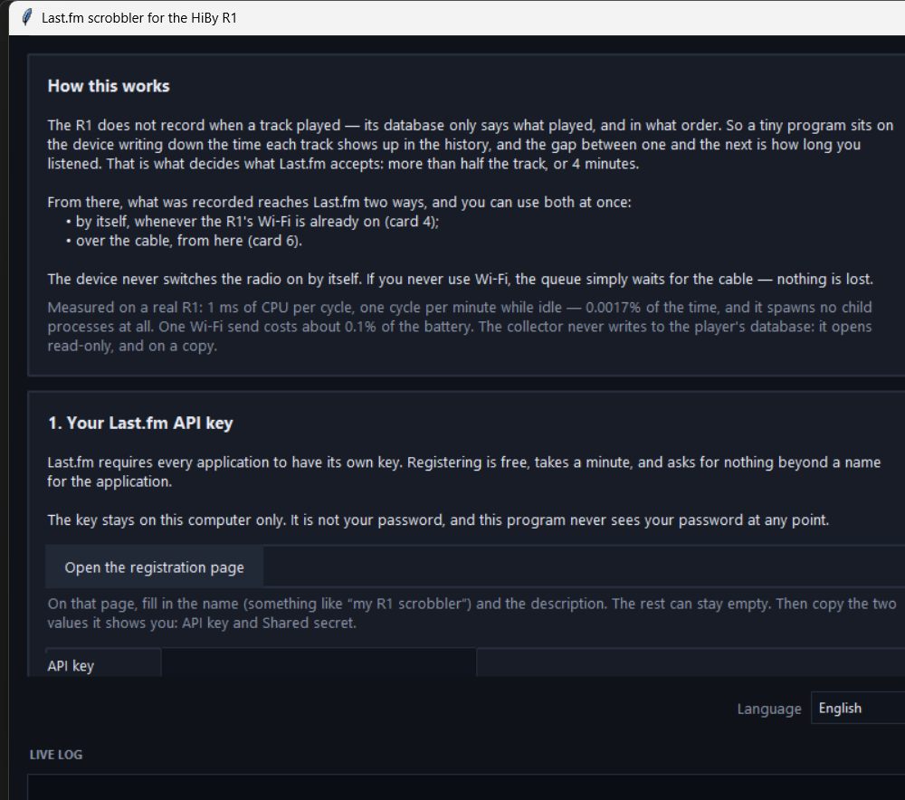
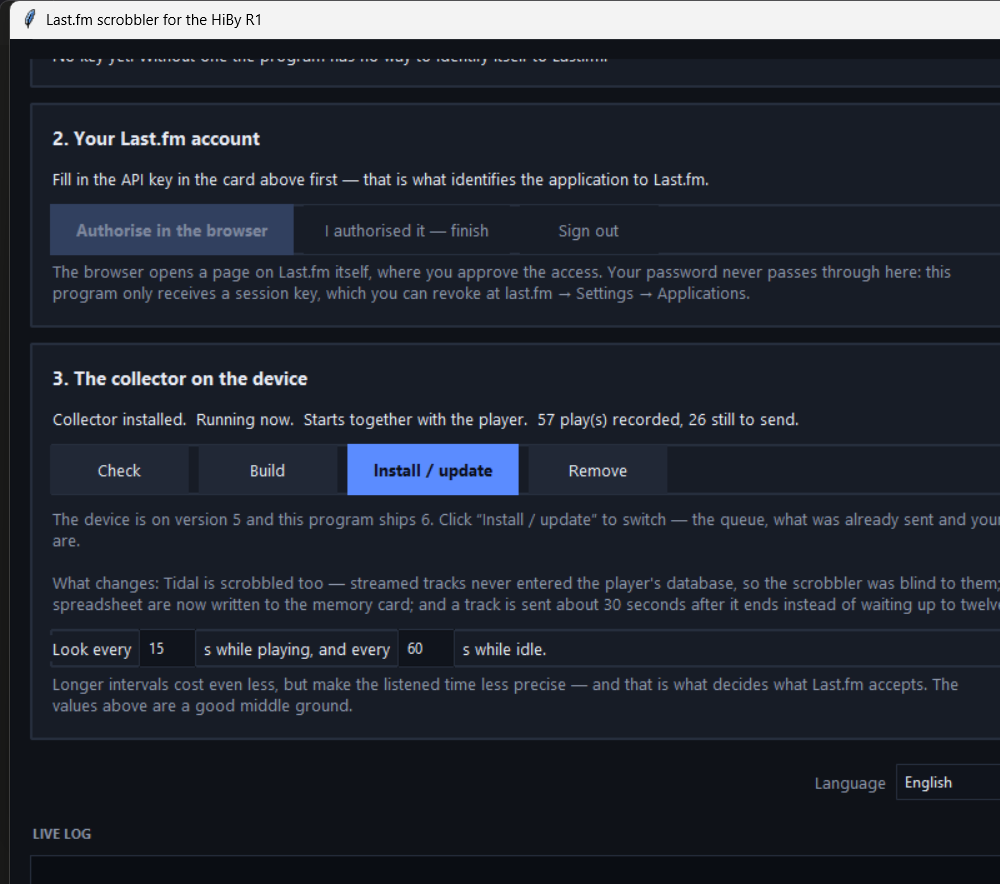
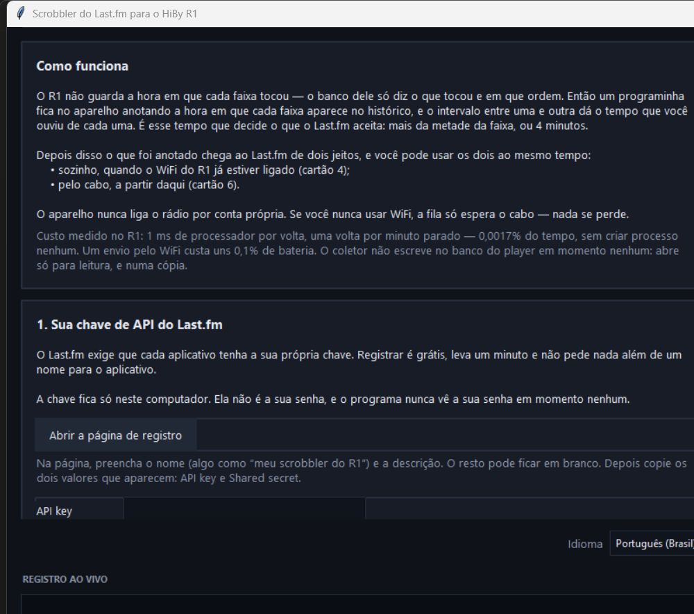

<h1 align="center">Last.fm scrobbler for the HiBy R1</h1>

<p align="center">
  <b>Scrobbles everything you play — local files <i>and</i> Tidal — including
  what you listened to with no network at all.</b><br>
  No root. No firmware modification. It never writes to the player's database.
</p>

<p align="center">
  
  
  
  
  
</p>

<p align="center">
  <a href="#what-it-does">Features</a> ·
  <a href="#step-by-step">Install</a> ·
  <a href="#what-it-costs-in-battery">Battery</a> ·
  <a href="#how-it-works-inside">How it works</a> ·
  <a href="#security-without-decoration">Security</a> ·
  <a href="README.pt-BR.md">Português</a>
</p>

---

The R1 has no scrobbling. This puts a tiny collector inside the player that
writes down what you listen to — offline, on a plane, in a car — and sends it
all to Last.fm afterwards. If the R1's Wi-Fi happens to be on, it sends by
itself, with no PC in the loop.

Works on the **plain HiBy R1** (Ingenic X1600, MIPS32 little-endian, stock
firmware 1.6 with ADB).

```bash
python r1lastfm.py
```

<p align="center">
  
</p>

One window, six cards, top to bottom. Nothing is hidden in menus, and every
card says what it is about to do before it does it.

<p align="center">
  
</p>

The interface is in **English and Portuguese**, English by default, switchable
from the bottom-right corner of the window at any time.

<p align="center">
  
</p>

---

## What it does

|  | |
|---|---|
| **Tidal, not just local files** | Streamed tracks never enter the player's local database — which is why a scrobbler that only reads that database is blind to them. This one reads the Tidal track id the player leaves behind and asks Tidal's own API for artist, title, album and duration, using the token already on your device. |
| **Offline collection** | A whole trip with no network: what played stays on the device and goes out when a connection appears. Nothing is lost, nothing is guessed. |
| **Two ways out, both at once** | Automatically over the R1's Wi-Fi, and/or over the cable from your PC. They never duplicate each other, because what was accepted is written down on the device. |
| **Live “now playing”** | The track you are playing pulses on your Last.fm profile — for local files and for Tidal. |
| **Honest listening times** | The seconds are **measured** — audio actually coming out of the device — not inferred from the gap between two history rows. Pausing suspends the count instead of ending the track; a track you skipped at 0:19 is recorded as 19 seconds and does not go. A track has to play almost to the end to count: 90% of it, stricter than the half Last.fm settles for. |
| **Fast** | The scrobble appears a couple of seconds after the track ends, not on a twelve-minute timer. |
| **A log and a spreadsheet on the SD card** | `<card>/r1lastfm/scrobbles.csv` and `r1lastfm.log`. Pull the card, open the CSV in a spreadsheet — no ADB, no this program, nothing. |
| **Cheap** | 1 ms of CPU per cycle, **zero child processes** while idle, 880 kB of RAM. Measured on the device. |
| **Yours** | Your own Last.fm API key, stored only on your computer. No account, no server, no telemetry, nothing phones home. |

### In detail

* **Scrobbles Tidal too.** Streamed tracks never enter the player's local
  database, which is why most R1 scrobblers cannot see them at all. This one
  reads the Tidal track id the player leaves behind and asks Tidal's own API
  for the details, using the token already on the device.
* **Records offline.** You can spend a whole trip with no network: what played
  stays on the device and goes out when there is a connection.
* **Sends over Wi-Fi by itself.** Every twelve minutes the R1 checks whether a
  route out already exists. If it does, it sends. It **never switches the radio
  on by itself** — that stays your decision.
* **Sends over the cable too.** For people who never use the device's Wi-Fi:
  plug in, click send, done. Both paths coexist without duplicating anything.
* **“Now playing”, live.** The track you are playing shows up pulsing on your
  profile, if you want it.
* **Counts only what you actually heard**, and counts it by measuring the
  audio: 90% of the track, or four minutes, whichever comes first. Last.fm
  settles for half, which meant a track you walked away from went up as if you
  had listened to it — so the bar here is higher. Pausing in the middle and
  coming back still counts as hearing the song; skipping halfway does not.
* **Sends within a few seconds** of a track ending, not on a twelve-minute
  timer.
* **Writes a log and a spreadsheet to the memory card**, at
  `<card>/r1lastfm/`: `r1lastfm.log` and `scrobbles.csv`. Pull the card, open
  the CSV in a spreadsheet — no ADB, no this program, nothing.

### The spreadsheet on the card

Real rows, straight off a device — Tidal tracks, with the ones you skipped
marked as such and the album title quoted because it contains a comma:

```csv
started_at,started_at_epoch,artist,track,album,album_artist,seconds_heard,track_seconds,status,rowid
2026-08-01 16:36:05,1785612965,Odeal,Coming Home (feat. Jorja Smith),Coming Home (feat. Jorja Smith),,223,223,sent,1000000006
2026-08-01 16:40:11,1785613211,Wale,Overthink,Overthink,,187,207,sent,1000000007
2026-08-01 16:45:00,1785613500,Too $hort,So So So Good,"SIR TOO $HORT, VOL. 2 (DRINK & SMOKE)",,19,142,skipped,1000000008
2026-08-01 16:45:19,1785613519,Train,Mad Dog in the Fog,Mad Dog in the Fog,,227,227,sent,1000000009
2026-08-01 16:53:38,1785613980,Remi Wolf,Twiggy,Twiggy,,38,209,skipped,1000000011
```

`status` is one of `sent`, `pending`, `playing`, `skipped`,
`track-too-short`, `too-old`, `future`, `bad-clock` or `no-metadata` — so you
can see not just what went, but why the rest did not. `playing` is the track
that has not finished yet; it is not a rejection, and it becomes `pending` on
its own once the track ends.

## What it costs in battery

Measured on the device, not estimated:

| | cost |
|---|---|
| collector, idle | 1 ms of CPU per minute — 0.0017% of the time, **zero child processes** |
| collector, playing | one cycle every 15 s, same 1 ms per cycle |
| memory | 880 kB RSS |
| one Wi-Fi send | ~0.1% of the battery |
| “now playing” | 10 ms per detection; 2.4 s of CPU per **hour** |

What actually costs is having Wi-Fi on — the radio draws 50-150 mW against the
~260 mW of the device playing, which takes 20-40% off the battery life. That
bill belongs to Wi-Fi, not to this program: with the radio off, the collector's
cost is indistinguishable from zero.

## Step by step

### 0. What you need

| | |
|---|---|
| **Python 3.9+ with Tkinter** | standard library only; nothing to `pip install` |
| **adb** (Android Platform Tools) | how the program talks to the R1 |

That is all, for everything except one optional feature. The two programs that
run on the R1 ship already compiled, in
[`r1lastfm/bin/`](r1lastfm/bin/) — you do **not** need a compiler.

**Only** if you want the R1 to send by itself over Wi-Fi do you also need
**WSL + Zig**, to build a static `curl` for the device. The program installs
Zig itself, verifying the SHA256 published by ziglang.org. Without it,
everything else works: it collects offline and sends over the cable.

<details>
<summary><b>Installing Python (with Tkinter)</b></summary>

Tkinter is the graphical toolkit this program's window is built on. It comes
with Python, but on some systems it is a separate package — which is why it is
called out here instead of being assumed.

**Windows** — get the installer from
[python.org/downloads](https://www.python.org/downloads/). Two boxes matter:

* tick **Add python.exe to PATH** on the first screen;
* leave **tcl/tk and IDLE** checked under *Optional Features* — that is Tkinter.

**macOS** — the installer from
[python.org/downloads](https://www.python.org/downloads/) ships a working Tk
and is the easy path. If you prefer Homebrew, Tkinter is a separate formula:

```sh
brew install python python-tk
```

**Linux** — Tkinter is almost always a separate package:

```sh
sudo apt install python3 python3-tk        # Debian, Ubuntu, Mint
sudo dnf install python3 python3-tkinter   # Fedora
sudo pacman -S python tk                   # Arch
sudo zypper install python3-tk             # openSUSE
```

**Check that it worked:**

```sh
python -c "import tkinter; print('Tkinter', tkinter.TkVersion)"
```

A version number means you are set. `ModuleNotFoundError: No module named
'tkinter'` means Python is installed but the Tk package is not — install it
with the line for your system above. `python r1lastfm.py --check` tells you
the same thing in plainer words, along with everything else it needs.

> On Linux, `python` may not exist while `python3` does. Use `python3` in both
> commands if that is your case.

</details>

<details>
<summary><b>Installing adb</b></summary>

Download the Android Platform Tools for your system:
<https://developer.android.com/tools/releases/platform-tools>

* **Windows** — unzip it into `C:\platform-tools`. That is one of the places
  this program looks, so nothing else is needed.
* **macOS** — `brew install android-platform-tools`.
* **Linux** — `sudo apt install adb` (or your distribution's equivalent).

Check it with `python r1lastfm.py --check`.
</details>

<details>
<summary><b>Installing WSL (Windows, optional)</b></summary>

Only needed for Wi-Fi sending and “now playing”. In a PowerShell running as
administrator:

```powershell
wsl --install -d Ubuntu
```

Restart, then open Ubuntu once so it can finish setting itself up. You do not
need to install Zig — the program does that when you ask it to build.
</details>

### 1. Register your own Last.fm API key

Go to <https://www.last.fm/api/account/create> (the program has a button that
opens it). Fill in a name — something like *my R1 scrobbler* — and a
description. Everything else can stay empty. Submit, and copy the two values it
shows you: **API key** and **Shared secret**.

Paste both into card 1 and click *Save*.

> **Why your own key, and not one shipped with the program?** A shared secret
> published in a public repository is not a secret. Anyone could impersonate
> the application, and Last.fm would revoke it the moment they noticed —
> breaking it for everybody. Registering takes a minute and it is yours.

The key is stored on your computer only, in `config.json`. It is not your
password, and this program never sees your password at any point.

### 2. Authorise your account

Click *Authorise in the browser* in card 2. A page on Last.fm itself opens,
where you approve the access. Come back and click *I authorised it — finish*.

What comes back is a **session key**, not your password. You can revoke it at
any time at *last.fm → Settings → Applications*.

### 3. Connect the R1 and install the collector

On the device: **System → USB working mode → Device**. Then plug in the cable.

> ADB and USB-DAC share the same USB controller and are mutually exclusive: in
> DAC mode `adbd` does not even start, and the device list is empty exactly the
> way it is with a bad cable. Also check that the cable carries data — many
> only charge.

In card 3, click **Install / update**. That is it — the programs that go on
the device ship prebuilt.

*(The **Build** button next to it is for people who would rather compile the
two device programs themselves. If you do, yours is used instead of the ones
that shipped. It needs Zig, which the program installs on its own.)*

### 4. Reboot the R1 — and read this if it does not come back up

The collector is added to `/usr/data/init.sh`. Reboot once and look at card 3.

**On stock HiBy firmware it will say “⚠ this firmware will not start it at
boot”, and that is not something you did wrong.** Nothing in the factory
firmware ever executes `/usr/data/init.sh`. I checked this against the real
1.6 update package rather than guessing: its `/usr/bin/hiby_player.sh` is
fourteen lines long and does not contain the string `/usr/data` at all, and no
other script, init file or binary in that image runs anything from writable
storage. `/` is mounted `squashfs (ro)`, so it cannot be patched at runtime
either.

`init.sh` is a convention that **modded** firmwares introduced — the podcast
mod ships a patched `hiby_player.sh` that runs it. If you have one of those,
card 3 says *“Starts together with the player”* and you can ignore all of this.

If you do not, you have two options, and everything else works normally either
way:

* **Patch your own firmware — the permanent fix.** Card 3 grows a **Fix
  auto-start…** button whenever it detects a firmware that will not start the
  collector. It takes your own stock `r1.upt`, adds the missing line, and
  writes a new package you install from the player's own update menu. It also
  turns **ADB on at boot**, which stock firmware never does — without that,
  this program cannot see a fresh R1 at all until you dig out the hidden
  developer switch.

  From the command line, if you prefer:

  ```bash
  python3 ferramentas/remendar_firmware.py --entendi-o-risco --com-adb r1.upt r1-autostart.upt
  ```

  A package built this way has been installed on a real R1 and booted: stock
  1.6, collector starting by itself, ADB up, cable working immediately.

  It changes two files and nothing else, and proves it before writing anything:
  it replays the device updater's own verification loop — reads the manifest,
  walks the chunks by their chained md5 names, checks each against the md5
  list, adds up the sizes — then unpacks its own output and diffs all 4,718
  files against your input: contents, permissions and ownership. Needs
  `squashfs-tools`, `genisoimage` and `p7zip-full` (run it in WSL on Windows).
  It never downloads or ships HiBy firmware — you supply the file.

  **Installing firmware cannot be undone from software.** Put a known-good
  `.upt` on the memory card *before* you flash. If an install ever hangs on
  *Upgrading…*, power off and power on holding **power + volume-up** — it
  installs the good firmware from the card. Do not flash on a low battery, or
  from a card with read errors.

* Press **Start now** in card 3
  whenever you plug the cable in. The collector then keeps running — offline,
  cable unplugged — until you power the player off. Equivalent by hand:

  ```
  adb shell "setsid /usr/data/scrobble/r1scrobbled </dev/null >/dev/null 2>&1 &"
  ```

Anything you listened to while it was stopped is **not** lost: the player's own
history database is what gets read, so the collector picks it all up the moment
it starts. It just cannot know the exact clock times, so it reconstructs them
back-to-back ending at the moment it woke up.

At this point everything already works over the cable. **If you never want to
use Wi-Fi, you are done**: listen to music, plug in when you feel like it, click
*Fetch the queue* and *Send to Last.fm*.

### 5. (Optional) Automatic Wi-Fi sending

In card 4, in this order:

1. **Build curl** — 20 to 30 minutes, once per machine. It downloads the curl
   and Mbed-TLS sources from both projects' official sites and cross-compiles
   them for the R1's MIPS, on your computer.
2. **Download certificates** — the root bundle published by the curl project.
   Without it the device cannot verify who it is talking to.
3. **Enable Wi-Fi sending** — this puts the session key and the two programs on
   the device.
4. **Send now (test)** — proves it works without waiting twelve minutes.

Tick *Show “now playing” on my profile* if you want live scrobbling. It applies
immediately, no reinstall needed.

### Checking without opening the window

```bash
python r1lastfm.py --check
```

And to see everything it *would* do, without touching the device:

```bash
python r1lastfm.py --dry-run
```

`--lang en` / `--lang pt` forces a language for one run without changing your
preference.

## How it works inside

The R1 keeps an SQLite database at `/usr/data/usrlocal_media.db` with a
`HISTORY_TABLE`. It says **what** played and **in what order**, but records the
time of nothing — and the time is what Last.fm needs.

So the collector (`collector.c`, a hand-written SQLite reader, ~770 lines, no
libsqlite) looks at the database now and then and writes down the **device's
clock** at the moment each new row appears. That gives the time a track
started. Track duration is not in the database either: it is computed from
`size * 8 / bit_rate`, which matched the real length to within half a second in
testing.

**How long you listened is measured, not inferred.** The obvious shortcut — the
gap between two history rows — is wall-clock time, not music, and it breaks in
three ways that happen every day: you pause and the gap counts the pause as
listening; the collector starts while music is already playing and the track
gets credited for time when nothing was watching; the last track of a session
has no next row at all. So instead the collector counts the seconds audio is
actually coming out of the device, and writes the total down.

Pausing does not end a track, because the device tells the difference: the
audio device closes but the player keeps the **file** open. Measured live, with
the pause pressed by hand — 50 s playing, 50 s paused with the file still open,
29 s playing again, and the history row never changed, because resuming writes
nothing. Audio out and no file open means playback really stopped.

The measurement carries its own uncertainty: the audio state is sampled every
so often, so each time it starts or stops, the exact moment is lost inside one
sampling interval. That uncertainty is added up and sent along, and the 90% bar
is judged with it — otherwise a track you heard to the end would be rejected
for a couple of seconds nobody could have counted. It never lowers the bar by
more than ten points.

Details that only turn up by working on the real device, and that are documented
in the code's comments:

* the player writes the history row **when the track starts**, not when it
  ends — watched live: the row changed the same second the track did, with
  audio still playing for another 45 s. An earlier measurement claimed the
  opposite; it was looking at the *previous* track's row, and the 194 s it
  reported was that track's length;
* so a track is closed by the *next* one starting. The last track of a run
  has nothing after it, and is closed by a marker the collector writes when
  it sees the audio device close;
* every TEXT value in the database carries a trailing NUL byte (the player
  writes C strings);
* the card's `most_played.db` is corrupt out of the factory (one row mixes one
  track's name with another's path); only its mtime is used, never its contents;
* the database is opened **read-only, and on a copy** — the player never sees
  this program.

Sending from inside the device is done by `r1send.c`, which assembles and signs
the batch (MD5 over the sorted parameters plus the secret, as the Last.fm API
requires) and calls a static `curl`. The daemon (`r1scrobbled.sh`) is busybox
ash and sleeps on a `read -t` over a fifo, which costs 34× less than calling
`sleep` — that is why it spawns no processes at all while waiting.

## Where things live

**On this computer**, in `%LOCALAPPDATA%\R1LastFm` (Windows),
`~/Library/Application Support/R1LastFm` (macOS) or `~/.local/share/r1-lastfm`
(Linux):

* `config.json` — your API key, the Last.fm session key, and your language;
* `registros/` — the full log of every session, with the exact commands, so any
  step can be redone by hand;
* `trabalho/` — the compiled binaries.

**On the device**, in `/usr/data/scrobble`: the queue, the list of what was
already sent, and (if you enable Wi-Fi sending) the session key. They live there
on purpose — using the program from another computer then re-sends nothing and
loses nothing.

## Security, without decoration

* The program **never sees your password**. Authorisation happens on a Last.fm
  page; what comes back is a session key, revocable at any time at
  *last.fm → Settings → Applications*.
* If you enable automatic sending, that key is **written to the device**, at
  `/usr/data/scrobble/sk` with mode 600. It does not give access to your
  password, but **anyone with ADB access to the device can read it**. If that
  bothers you, use cable sending only: it works just as well, and nothing leaves
  the PC.
* Without the certificate bundle on the device, the daemon **refuses to send**
  rather than handing over the key without checking who is on the other end.
* No binary is downloaded ready-made. `curl` is compiled on your machine from
  the official curl and Mbed-TLS sources, and whatever comes out still goes
  through an ELF check before reaching the device.

## Uninstalling

The **Remove** button, in card 3, takes everything out: the programs, the
`init.sh` block, and (if you say so) the queue. Nothing outside
`/usr/data/scrobble` and `/usr/data/init.sh` is ever touched.

## It did not work?

The session log has the exact command for every step — it is the first place to
look, and it is designed so you can redo it by hand line by line. Some common
cases:

* **“it says installed but it is not running / it never starts by itself”** —
  on stock firmware it cannot. See [step 4](#4-reboot-the-r1--and-read-this-if-it-does-not-come-back-up):
  nothing in the factory image executes `/usr/data/init.sh`. Card 3 tells you
  when this is your case. Use **Start now**, or a patched firmware.
* **“nothing shows up on Last.fm after a reboot”** — if card 3 *does* say
  *Starts together with the player*, then your `init.sh` may have an `exit`
  before the scrobbler block; the program inserts the block **before** the
  first `exit` for exactly this reason.
* **“I listened to a whole album and it logged 0 seconds”** / **“a track counted
  as fully played the moment it started”** — fixed in version 8. The player
  writes its history row when a track **starts**, not when it ends (watched
  live on the device: the row changed the same second the track did, with
  audio still playing for another 45s). The code assumed the opposite, so the
  gap between two rows — which is how long the *first* one played — was being
  credited to the *second*. Update the device (card 3) to get it.
* **“there is no scrobbles.csv on my card”** — fixed in version 8. The program
  that writes it only got installed together with Wi-Fi sending, so if you set
  up the collector over the cable and stopped there, no spreadsheet was ever
  written. It now ships with the collector, and card 3 shows you the exact path
  on the card.
* **“automatic sending never sends”** — the R1 does not turn Wi-Fi on by
  itself. Turn it on and wait up to twelve minutes, or use *Send now (test)*.
* **“old scrobbles do not go up”** — Last.fm refuses timestamps older than 14
  days. Nothing to be done.

## Running the tests

```bash
python testes/t_scrobble_all.py
```

Twelve modules: the SQLite reader in C against real SQLite, the daemon running
under busybox ash, queue reconstruction, signing, automatic sending, live “now
playing”, the `init.sh` edits, the device API against a fake adb, the ELF check,
the window itself, and the translation catalogue.

Tests that talk to the real Last.fm API are skipped unless you provide your own
key:

```bash
LASTFM_API_KEY=... LASTFM_API_SECRET=... python testes/t_scrobble_all.py
```

## Translating

Every user-visible string lives in [`r1lastfm/textos.py`](r1lastfm/textos.py),
one key per message, one entry per language. To add a language, add its code to
`IDIOMAS` in [`r1lastfm/idioma.py`](r1lastfm/idioma.py) and a matching entry to
every key. Then run:

```bash
python testes/t_idioma.py
```

It walks the whole source, collects every key that is asked for, and tells you
exactly which ones you missed — including any whose `{placeholders}` do not
match the English original.

## Credits

Written with [Claude Code](https://claude.com/claude-code) (Anthropic).

The SQLite file format, the R1's `HISTORY_TABLE` behaviour and the battery
numbers above were all worked out on the device, by measuring — not estimating.

MIT licence, in [LICENSE](LICENSE).
